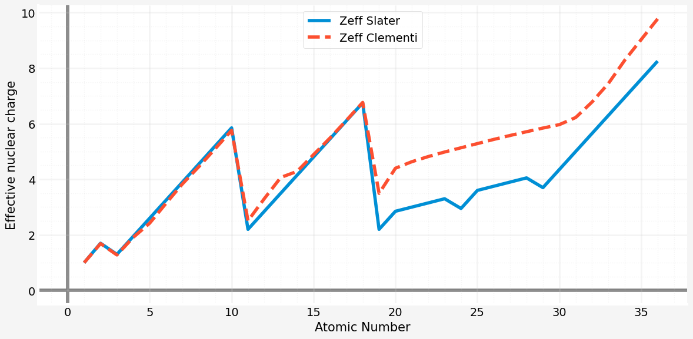

# Zeff

An effective nuclear charge (Zeff) and shielding (S) calculator and graphing tool.

## Introduction

If you are a chemistry teacher or student chances are that you are going to do Zeff and S calculations based on [Slater's Rules](https://en.wikipedia.org/wiki/Slater%27s_rules) or on [Clementi *et al* screening constants](https://en.wikipedia.org/wiki/Effective_nuclear_charge#Values). Probably while teaching/learning periodic trends.

This simple project automates these calculations returning them as tables (Pandas DataFrames) so that one can easily plot the data or manipulate them. Indeed, there are plot functions that can do graphs providing a convenient visualization functionality for classes.

## Installation

Just clone or download this repo. This is not a package (yet, maybe someday :-))

## Usage

Look at some examples at the [tutorial](Zeff_tutorial.ipynb) available as a [Jupyter notebook](https://jupyter.org/).

## Under the hood - Requirements

This project relies heavily on [`mendeleev`](https://pypi.org/project/mendeleev/), [`pandas`](https://pandas.pydata.org/) and [`matplotlib`](https://matplotlib.org/) packages so these must be installed. Check the [`environment.yml`](environment.yml) file for requirements and feel free to use it to create a virtual environment with [`conda`](https://docs.conda.io/en/latest/) or other similar tool.

## Contributing

All contributions are welcome.

**Issues**

Feel free to submit issues regarding:

- recommendations
- more examples for the tutorial
- enhancement requests and new useful features
- code bugs

**Pull requests**

- before starting to work on your pull request, please submit an issue first
- fork the repo
- clone the project to your own machine
- commit changes to your own branch
- push your work back up to your fork
- submit a pull request so that your changes can be reviewed

## License

MIT, see [LICENSE](LICENSE)

## Citing

If you use Zeff in a scientific publication or in classes, please consider citing as

F. L. S. Bustamante, *Zeff* - An effective nuclear charge (Zeff) and shielding (S) calculator and graphing tool., 2019 - Available at: https://github.com/chicolucio/zeff

## Funding

If you enjoy this project and would like to see many more science related programming projects, I would greatly appreciate any assistance. Send me an e-mail to know how to assist. Many more projects are to come and your support will be rewarded with more science coding projects :-)
